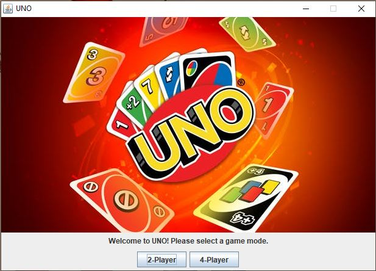
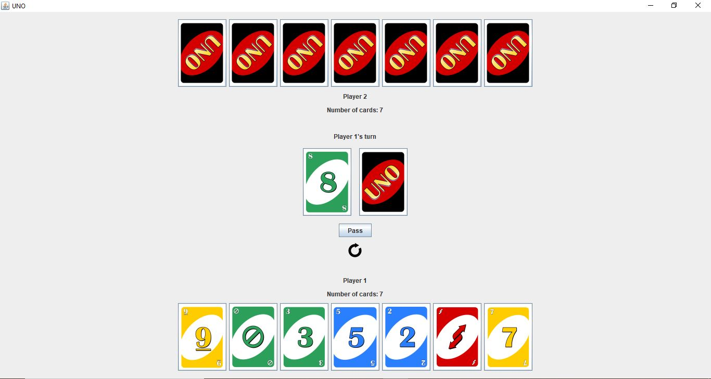
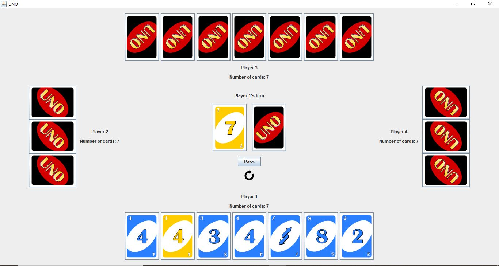

# About
UNO game made with Java. Has a two-player and a four-player mode. The user is the only human player, all other players are AI.

# Rules
The game follows the original [UNO rules](https://www.ultraboardgames.com/uno/game-rules.php).

# How To Play
The primary objective in this game is to play all of your cards before your opponent(s). It is turn-based, with the first turn generating randomly. Play direction is initially clockwise. A card is played by clicking on it, and then clicking on the card in the discard pile. Only valid playable cards are played, a message is displayed otherwise. The player may draw a card by clicking on the draw pile. The game's GUI design only allows 7 cards to be displayed on the screen for the human player (user). When the player has more than 7 cards, they may traverse their hand by using the left and right arrow keys. There are indicators for current play direction, current turn, and number of cards for each player.

# Screenshots
Start menu:

Two-player mode:

Four-player mode:

